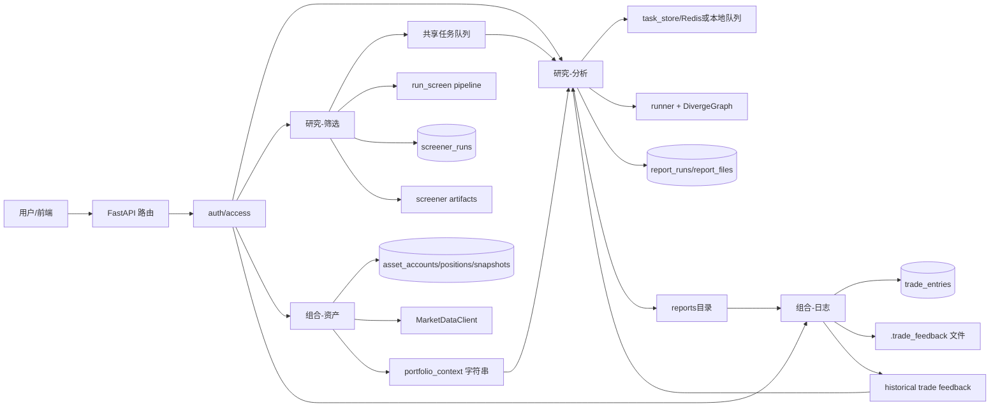

# romn77/Diverge dev 分支代码与业务评审

## 审查快照

- 审查对象：`romn77/Diverge dev`
- 固定版本：`f822c0108b0377e16c7eccffb4d96a2dded33bb6`
- 审查日期：`2026-04-27`
- 报告定位：内部代码与业务风险评审，不是正式第三方安全审计。
- 审查方式：静态源码审查；未验证真实生产环境、数据库权限、对象存储策略和第三方 API 运行态。
- 范围说明：本报告聚焦代码整洁度、业务链路与模块边界、权限与隔离、报告公开/私有与筛选结果公开路线；未覆盖压测、渗透测试、依赖 CVE 扫描和云资源配置核验。

## 执行摘要

基于固定版本 `f822c0108b0377e16c7eccffb4d96a2dded33bb6` 的源码，我的总体判断是：这个仓库已经从原始 Diverge fork 成一个“研究分析 + 选股筛选 + 资产台账 + 交易日志 + Web Workbench + 基础权限/部署”的内部研究台 MVP。方向是对的，工程骨架也已经搭起来了；README 已经明确列出多数据源路由、CN/US screener、Web Workbench、认证/管理和生产式部署能力。[R1]

报告主线建议收敛到四个模块：代码整洁度、业务链路与模块边界、权限与隔离、报告公开/私有与筛选结果公开路线。主要优点是顶层目录分层清楚、数据模型已经覆盖报告/筛选/资产/交易日志四类对象，并且主干流程有 focused checks。主要短板集中在 orchestrator/service 层过胖、权限仍是粗粒度角色 + owner scope、迁移模式下存在 optional auth 匿名读取报告的条件风险，以及 Massive 市场数据默认走明文 HTTP IP。[R3][R5][R9][R12][R17]

结论：它适合内部团队使用和快速迭代，但不适合直接上线匿名公开的“报告广场”。更合理的当前路线是先做“私有报告 + 工作区公开报告 + 筛选结果默认工作区公开”，把真正的报告广场降级为二期能力，等搜索、标签、精选、审核、举报、排序和脱敏策略补齐后再推进。

## 代码整洁度

从“目录级模块化”看，这个仓库是过关的；核心 agent/graph/dataflows 在 `diverge/`，筛选管线在 `diverge/screener/`，Web 前后端在 `web/`，部署与运维脚本在 `scripts/` 和 `compose.prod.yml`。从“函数级复杂度与职责收敛”看，问题已经开始显性化：核心问题不是命名混乱，而是**职责堆叠**、**跨模块粘连**和**工程入口不够单一**。[R1][R5][R20][R21]

测试并非没有，反而已经覆盖了任务队列、筛选、配置、路径安全等主干流程；但测试策略仍然是 focused checks，没有演进成 coverage gate、lint gate 或 type-check gate。依赖治理也不是“没有 lockfile”，而是存在 `uv.lock` 的同时还有多个安装入口和浮动约束，生产安装入口与 CI 审计门禁需要明确。[R15][R16][R17]

| 问题 | 位置 | 严重性 | 影响 | 修复建议 |
|---|---|---:|---|---|
| 可变默认参数 | `diverge/graph/trading_graph.py:41`，`__init__(selected_analysts=[...])`。[R18] | 中 | 典型 Python 可维护性隐患；今天没副作用，不代表未来不会被修改触发共享状态。 | 改为 `None`，在函数体内赋默认值。 |
| 队列容量判断与 SSE 序列化重复 | `web/backend/routers/tasks.py` 与 `web/backend/routers/screeners.py` 有相似的任务创建、限流和事件流逻辑。[R20] | 中 | 同一套规则要改两处，容易出现分析/筛选行为漂移。 | 抽出 `queue_guard.py` 和 `sse.py`，统一 active/pending/user-limit 逻辑。 |
| 报告头解析重复 | `web/backend/services/reports.py` 与 `web/backend/report_metadata.py` 各自实现了标题/生成时间解析。[R10][R11] | 低 | 报告格式一旦调整，要双改；容易出现索引结果和实际展示不一致。 | 抽成共享 parser，并以单元测试锁定格式。 |
| orchestrator/service 过胖 | `web/backend/runtime/analysis_tasks.py`、`diverge/runner.py`、`web/backend/services/assets.py` 都同时承担多项职责。[R21][R22][R23] | 高 | 测试难、复用差，也让权限与审计很难精准下沉。 | 分出 `report_publisher`、`portfolio_context_builder`、`analysis_task_orchestrator` 等更窄的应用服务。 |
| 状态 schema 命名漂移 | `DivergeGraph` 持久化日志时写入 `trader_investment_decision`，主流程普遍使用 `trader_investment_plan`，`trade_feedback` 又读取前者。[R18][R19] | 中 | 下游消费方要记两套 key；后续做搜索、索引、公开副本时容易踩坑。 | 统一 schema 名称；为旧日志提供一次性迁移脚本。 |
| 依赖与配置源不够单一 | `pyproject.toml` 和后端 requirements 使用浮动约束；仓库有 `uv.lock`，但生产安装入口和 CI 审计门禁仍需明确。[R15][R16] | 中 | 多入口安装容易造成环境漂移；仅存在 lockfile 不等于生产路径一定使用 lockfile。 | 明确生产安装以 `uv.lock` 或等效锁定产物为准；清理重复依赖和重复 env key；在 CI 中校验一致性。 |
| 测试覆盖“不均衡”而非“没有” | README 列出 focused checks，但没有 coverage/lint/type-check 门禁说明。[R17] | 中 | 主干流程回归能力不错，但资产、交易日志、多租户权限矩阵、公开/私有可见性切换仍缺专测。 | 补 permission matrix、assets/trades、public/private visibility、migration/backfill 专项测试。 |

结论上，这个仓库已经有“能维护”的雏形，但要跨过“能迭代”和“能规模化”的分水岭，关键不是再添模块，而是把 orchestration、schema、依赖和测试门禁收紧。

## 业务链路与模块边界

当前四个业务对象已经形成了比较完整的闭环，但它们并不是彼此独立的“小系统”，而是一个以研究为核心的联动体：分析模块会主动读取资产上下文和日志反馈，筛选模块与分析模块共享队列和数据源治理，日志模块又会反向影响分析 prompt，最终输出的报告再由报告元数据层做可见性管理。[R20][R21][R22][R23][R24][R25][R26]

真正的复杂度并不在 agent graph 内核，而在 Web 后端的 orchestrator/service 层：分析任务要做请求校验、额度控制、用户上下文拼装、任务排队、报告落盘、对象存储上传、元数据写库；筛选任务要做数据源决策、manifest 注入、进度事件、结果快照；资产和日志又不仅是 CRUD，还直接反向注入研究 prompt。[R20][R21][R22][R23][R24]

下面这个图概括了关键数据流与权限流。核心结论是：**分析模块不是纯研究模块，而是“研究 + 资产上下文 + 历史交易复盘”的融合模块**；因此它天然比筛选模块更敏感。

| 模块 | 当前职责 | 上下游依赖 | 边界评价 |
|---|---|---|---|
| 研究-分析 | 创建任务、排队、调用 `DivergeGraph`、写报告、写报告元数据 | 依赖资产模块生成 `portfolio_context`；依赖日志模块回放 `visible_trade_ids`/historical feedback；依赖共享队列与数据源治理。[R21][R22][R23][R24] | 业务价值最高，但边界最不干净；属于“个性化研究输出”。 |
| 研究-筛选 | 创建筛选任务、解析 markets/manifest、运行 `run_screen`、保存候选与运行元数据 | 与分析共享任务队列和 vendor routing；通过 `screener_runs.owner_user_id` 做 owner scope。[R20][R26] | 边界比分析清晰，但与分析共享资源池；当前没有筛选项设置，也没有 visibility 维度。 |
| 组合-资产 | 账户/仓位/估值快照管理，并把持仓摘要拼成 prompt context | DB 原生存储；调用 `MarketDataClient`；直接服务分析模块。[R23] | 域模型是清楚的，但暴露给分析的接口是“字符串 prompt”，不是稳定 DTO。 |
| 组合-日志 | 交易记录/复盘生成/反馈回放；文件与 DB 索引混合持久化 | 依赖报告目录中的分析快照；反向喂给分析模块。[R22][R24] | 边界最模糊：既是日志，又是 research memory，还依赖文件系统路径。 |

从耦合度看，系统当前有四个单点信任：`.env` secret 与 provider 凭据、共享任务队列、PostgreSQL ownership metadata、以及磁盘/对象存储中的报告与 trade artifacts。最需要警惕的不是“模块间有调用”，而是**分析模块对资产与日志的直接 prompt 级耦合**：这会让任何分析报告天然携带用户特征，进而把权限、脱敏、公开发布都变成高风险动作。

筛选模块的产品边界也需要单独点出来：在没有筛选项设置的情况下，筛选结果更像“公共市场数据上的批处理产物”，比个性化分析报告敏感度低。因此，短期把筛选结果默认设为工作区可见是合理的；但这只是过渡设计，一旦加入自定义筛选条件、私有股票池、私有 manifest 或用户偏好，筛选结果也必须支持私有/工作区公开切换。

## 权限与隔离

安全基线并非空白。源码已经做了几件正确的事：ticker 和报告读取路径有 traversal 防护，session token 只以哈希形式落库，登录失败有限流，生产 compose 默认启用 `AUTH_MODE=required` 和 `SESSION_COOKIE_SECURE=true`。[R5][R6][R7][R9]

当前权限模型的现实状态是：角色只有 `admin/operator/viewer` 三层；研究、筛选、资产、日志四个模块共用 weekly usage limit 模型；实际对象访问主要靠 `owner_user_id` 做 owner scope；报告有 `private/workspace` 两级可见性，而筛选结果没有 visibility 字段。[R25][R26][R27]

根据 NIST 对 RBAC 层级/约束模型的定义，下一步应该从“角色存在”升级到“角色 + 模块能力 + 约束 + 租户边界”。[R28]

我的结论很明确：**“研究”栏目下的两个模块都需要用户权限划分和数据隔离，其中“分析”必须比“筛选”更严格。**原因是分析任务会注入 `portfolio_context` 和历史交易反馈，保存的报告也可能包含这些上下文折射；而筛选任务虽然当前更偏公共数据驱动，但一旦用户使用自定义 manifest、筛选条件或共享候选池，它同样会沉淀可交易 alpha。

另一个不能忽略的细节是：`web/README.md` 的 backfill 方案会把历史报告设成 `workspace` 并指派给 bootstrap admin。这对单用户迁移可接受，但对多租户 SaaS 明显不够。[R4]

| 方案 | 适用场景 | 优点 | 缺点 | 实现复杂度 | 推荐优先级 |
|---|---|---|---|---:|---:|
| 最小权限 owner-only | 内部小团队、先保住隐私 | 改动最小；与现有 `owner_user_id` 模型最贴合；分析/筛选都能快速收口 | 不支持团队协作与共享 | 低 | 最高 |
| 角色模型升级为 module-scoped RBAC | 同组织多岗位协作 | 可把 `analysis:create/read`、`screener:create/read`、`assets:write`、`journal:write` 分开；适合 viewer/operator/admin 演进 | 需要路由与 service 层全面补 capability check | 中 | 很高 |
| 增加 tenant_id 的租户隔离 | 面向外部客户或多个业务单元 | 真正解决跨组织数据边界；管理员不再天然全局可见 | 需要改表结构、查询条件、回填脚本和审计逻辑 | 中高 | 很高 |
| 审计日志 + 分享策略 | 工作区公开、后续广场、付费分享、合规追踪 | 适合作为共享/发布层；能追踪谁发布、谁访问、谁撤回 | 不能替代 owner/tenant 隔离，只是补充 | 中 | 高 |

高优先级风险同样明确。参考 OWASP 对会话、错误处理和日志最小暴露的建议，当前最大问题不是密码学实现，而是**配置驱动的数据暴露**、**第三方链路默认值**和**内部错误直出**。[R29][R30]

| 风险 | 定位与复现/定位路径 | 优先级 | 修复建议 |
|---|---|---:|---|
| 可选认证下的报告匿名可读 | 生产 compose 默认 `AUTH_MODE=required`，但 `AUTH_MODE=optional` 会让 `enforce_authenticated_api_access` 放行；报告服务在未登录时会回退到磁盘枚举和文件读取。复现：非本地或迁移窗口外设置 `AUTH_ENABLED=true, AUTH_MODE=optional`，生成任意报告后，不登录请求 `/api/reports` 和 `/api/reports/{id}/content?path=complete_report.md`。[R3][R5][R7][R8][R9] | 条件 P0 | 非本地环境和迁移窗口外禁用 `optional`；把“迁移过渡可读”改为一次性后台回填任务，不要留在线匿名回退。 |
| Massive 数据源仍走明文 HTTP | `.env.example` 和 `diverge/dataflows/vendors/massive/common.py` 已迁移到 `http://bcprivateserver.site/api/v1`，不再回退到旧裸 IP；但默认链路仍是 HTTP。[R12][R13] | 中 P1 | 生产环境改用 HTTPS 域名；启动时校验 scheme 与 host。 |
| 内部错误直接返回给客户端/SSE | `web/backend/access.py` 直接 `detail=str(exc)`；报告读取失败会回传底层异常；分析/筛选任务也会把 `str(exc)` 写入任务错误和进度事件。[R9][R14][R21] | 高 P1 | 对外返回稳定错误码和通用消息；详细异常只写结构化日志。 |
| 依赖漏洞治理缺口 | 项目有 `uv.lock`，但 `pyproject.toml`、根 `requirements.txt`、`web/backend/requirements.txt` 形成多个安装入口，且源码内未体现自动审计门禁。[R15][R16] | 中 P1 | 明确生产安装真相源；在 CI 加 `pip-audit`/SBOM/Dependabot 或等效管线。 |
| 会话防护对“工作区公开/后续广场/分享链接/多子域”场景不够 | 后端使用 cookie session，CORS 允许 credentials；当前主要依赖 SameSite 和 origin 配置，没有显式 anti-CSRF token / Origin-Referer 校验。对单一前端域名尚可，但一旦引入分享页、嵌入页或多子域，会放大风险。[R29][R31] | 中 P2 | 若计划做广场、分享链接或多子域，补充 CSRF token / Origin 校验，并限制 cookie Domain/Path。 |
| 密钥管理是“项目根目录 .env + 运行期注入”模型 | `app_config.py` 与 `auth.py` 在 import 时加载 `.env`，`services/config.py` 在请求阶段把 provider key 注入进 `os.environ`。[R32][R33] | 中 P2 | 改到进程启动时一次性装载或使用 Secret Manager；按服务、按环境最小化暴露。 |

就安全优先级而言，**P0 是 Massive 明文 HTTP 第三方入口，以及 optional auth 在非本地/迁移窗口外启用时造成的匿名报告暴露**；**P1 是错误暴露和依赖治理**；**P2 是会话/secret 管理的进一步工程化**。

落地建议是分两步：先把分析、资产、日志收紧为 **owner-only + admin override**，同时让报告和筛选结果都走明确的 `private/workspace` 可见性语义；再往 **module-scoped RBAC + tenant_id** 演进。对当前“研究”栏目而言，默认值应按敏感度分层：**分析报告默认私有，允许用户显式选择工作区公开；筛选结果在缺少筛选项设置的阶段默认工作区公开，但后续必须补私有/工作区公开切换。**

## 报告公开/私有与筛选结果公开路线

原“报告广场”不应作为当前 MVP 目标。当前更稳妥的路线是：先在已登录工作区内做“私有报告 + 工作区公开报告 + 筛选结果默认工作区公开”，把真正面向外部访客的广场降级为二期。这样既能满足团队共享，又不会过早暴露匿名访问、脱敏、审核和撤回能力的缺口。[R25][R26]

技术上，这个仓库已经具备报告公开/私有的基础：`report_metadata` 提供 `private/workspace` 两级 visibility，并能按 owner 与 workspace 维度查询；报告生成链路也已经会写入报告文件、summary/thesis artifacts 和 report metadata。[R22][R25]

因此，MVP 可以采用以下边界：

| 能力 | 当前建议 | 说明 |
|---|---|---|
| 报告创建 | 增加“私有 / 工作区公开”选择，默认私有 | 分析报告可能含资产上下文和历史交易反馈，不能默认公开。 |
| 报告分析页 | 增加“公开报告”栏目 | 展示 `visibility=workspace` 的报告，只对已登录工作区用户可见。 |
| 报告读取 | 私有报告 owner/admin 可读；工作区公开报告登录用户可读 | 不引入匿名 public，不做外链分享。 |
| 筛选结果 | 当前默认 `workspace` 可见 | 由于还没有筛选项设置，筛选结果暂按公共市场批处理产物处理。 |
| 筛选详情 | 工作区用户可查看完整结果 | 包含 run detail、candidates、artifact manifest；匿名用户不可访问。 |
| 二期广场 | 搜索、标签、精选、审核、举报、排序、脱敏策略齐备后再做 | 二期若要对外公开，应优先做脱敏公共副本，而不是直接公开原始完整报告。 |

把这个路线落成工程计划，可以分三段：

| 周期 | 任务清单 | 预估工作量 | 主要风险 |
|---|---|---:|---|
| 短期 | 非本地环境和迁移窗口外禁用 `AUTH_MODE=optional`；删除 Massive 明文 HTTP 默认值；对外隐藏内部错误细节；报告创建增加 `private/workspace` 选择；报告分析页增加“公开报告”栏目；筛选结果默认 `workspace` 可见；补“匿名读报告”“private/workspace visibility”“assets/trades 权限矩阵”回归测试 | 1-2 周 | 改动虽小，但会暴露历史迁移脚本、前端列表过滤和现有 owner scope 假设 |
| 中期 | 引入 module-scoped permissions；给筛选结果补 `private/workspace` 切换；给所有核心表补 `tenant_id`；把 report publication 与 screener sharing 建统一审计日志 | 4-8 周 | 数据迁移、索引回填、前后端契约变化 |
| 长期 | 上线真正报告广场：摘要流、搜索、排序、标签、作者页、私链分享、付费全文、审核/举报/撤回；拆分 analysis 与 screener 的队列/预算/限额治理；将对象存储、审计、分享和计费真正产品化 | 3-6 个月 | 一旦对外，权限与脱敏缺陷会从“工程问题”变成“产品事故” |

这条路线的关键不是一次性做“大而全”的平台，而是先把**私有研究、工作区共享、筛选结果协作、外部公开广场**四层能力解耦。当前代码最适合先做“私有报告 + 工作区公开报告 + 筛选结果默认工作区公开”的组合，而不是直接公开完整报告或匿名广场。

## 证据索引

- [R1] README fork capabilities: [README.md#L41-L51](https://github.com/romn77/Diverge/blob/f822c0108b0377e16c7eccffb4d96a2dded33bb6/README.md#L41-L51)
- [R2] Repository layout: [README.md#L53-L65](https://github.com/romn77/Diverge/blob/f822c0108b0377e16c7eccffb4d96a2dded33bb6/README.md#L53-L65)
- [R3] Auth rollout modes: [README.md#L238-L242](https://github.com/romn77/Diverge/blob/f822c0108b0377e16c7eccffb4d96a2dded33bb6/README.md#L238-L242), [web/README.md#L96-L100](https://github.com/romn77/Diverge/blob/f822c0108b0377e16c7eccffb4d96a2dded33bb6/web/README.md#L96-L100)
- [R4] Metadata backfill defaults: [web/README.md#L125-L141](https://github.com/romn77/Diverge/blob/f822c0108b0377e16c7eccffb4d96a2dded33bb6/web/README.md#L125-L141)
- [R5] Production compose auth defaults: [compose.prod.yml#L63-L70](https://github.com/romn77/Diverge/blob/f822c0108b0377e16c7eccffb4d96a2dded33bb6/compose.prod.yml#L63-L70), [compose.prod.yml#L115-L118](https://github.com/romn77/Diverge/blob/f822c0108b0377e16c7eccffb4d96a2dded33bb6/compose.prod.yml#L115-L118)
- [R6] Auth settings and modes: [web/backend/auth.py#L34-L40](https://github.com/romn77/Diverge/blob/f822c0108b0377e16c7eccffb4d96a2dded33bb6/web/backend/auth.py#L34-L40), [web/backend/auth.py#L388-L420](https://github.com/romn77/Diverge/blob/f822c0108b0377e16c7eccffb4d96a2dded33bb6/web/backend/auth.py#L388-L420)
- [R7] Required-mode API guard: [web/backend/auth.py#L950-L956](https://github.com/romn77/Diverge/blob/f822c0108b0377e16c7eccffb4d96a2dded33bb6/web/backend/auth.py#L950-L956)
- [R8] Reports router guard: [web/backend/routers/reports.py#L8-L23](https://github.com/romn77/Diverge/blob/f822c0108b0377e16c7eccffb4d96a2dded33bb6/web/backend/routers/reports.py#L8-L23)
- [R9] Reports filesystem fallback and content read: [web/backend/services/reports.py#L229-L357](https://github.com/romn77/Diverge/blob/f822c0108b0377e16c7eccffb4d96a2dded33bb6/web/backend/services/reports.py#L229-L357)
- [R10] Report header parser in reports service: [web/backend/services/reports.py#L12-L44](https://github.com/romn77/Diverge/blob/f822c0108b0377e16c7eccffb4d96a2dded33bb6/web/backend/services/reports.py#L12-L44)
- [R11] Report header parser in metadata service: [web/backend/report_metadata.py#L56-L84](https://github.com/romn77/Diverge/blob/f822c0108b0377e16c7eccffb4d96a2dded33bb6/web/backend/report_metadata.py#L56-L84)
- [R12] Massive default URL and request path: [diverge/dataflows/vendors/massive/common.py#L14-L30](https://github.com/romn77/Diverge/blob/f822c0108b0377e16c7eccffb4d96a2dded33bb6/diverge/dataflows/vendors/massive/common.py#L14-L30), [diverge/dataflows/vendors/massive/common.py#L64-L82](https://github.com/romn77/Diverge/blob/f822c0108b0377e16c7eccffb4d96a2dded33bb6/diverge/dataflows/vendors/massive/common.py#L64-L82)
- [R13] `.env.example` provider variables: [.env.example#L88-L101](https://github.com/romn77/Diverge/blob/f822c0108b0377e16c7eccffb4d96a2dded33bb6/.env.example#L88-L101)
- [R14] Auth error translation: [web/backend/access.py#L10-L21](https://github.com/romn77/Diverge/blob/f822c0108b0377e16c7eccffb4d96a2dded33bb6/web/backend/access.py#L10-L21)
- [R15] Python dependency declarations: [pyproject.toml#L11-L58](https://github.com/romn77/Diverge/blob/f822c0108b0377e16c7eccffb4d96a2dded33bb6/pyproject.toml#L11-L58)
- [R16] Install entrypoints and lockfile: [requirements.txt#L1-L1](https://github.com/romn77/Diverge/blob/f822c0108b0377e16c7eccffb4d96a2dded33bb6/requirements.txt#L1-L1), [web/backend/requirements.txt#L1-L8](https://github.com/romn77/Diverge/blob/f822c0108b0377e16c7eccffb4d96a2dded33bb6/web/backend/requirements.txt#L1-L8), [uv.lock#L1-L20](https://github.com/romn77/Diverge/blob/f822c0108b0377e16c7eccffb4d96a2dded33bb6/uv.lock#L1-L20)
- [R17] Focused checks: [README.md#L273-L278](https://github.com/romn77/Diverge/blob/f822c0108b0377e16c7eccffb4d96a2dded33bb6/README.md#L273-L278)
- [R18] Graph defaults and persisted decision key: [diverge/graph/trading_graph.py#L36-L44](https://github.com/romn77/Diverge/blob/f822c0108b0377e16c7eccffb4d96a2dded33bb6/diverge/graph/trading_graph.py#L36-L44), [diverge/graph/trading_graph.py#L250-L258](https://github.com/romn77/Diverge/blob/f822c0108b0377e16c7eccffb4d96a2dded33bb6/diverge/graph/trading_graph.py#L250-L258)
- [R19] Trade feedback snapshot key use: [diverge/trade_feedback.py#L670-L680](https://github.com/romn77/Diverge/blob/f822c0108b0377e16c7eccffb4d96a2dded33bb6/diverge/trade_feedback.py#L670-L680)
- [R20] Analysis and screener routers: [web/backend/routers/tasks.py#L19-L102](https://github.com/romn77/Diverge/blob/f822c0108b0377e16c7eccffb4d96a2dded33bb6/web/backend/routers/tasks.py#L19-L102), [web/backend/routers/screeners.py#L17-L132](https://github.com/romn77/Diverge/blob/f822c0108b0377e16c7eccffb4d96a2dded33bb6/web/backend/routers/screeners.py#L17-L132)
- [R21] Analysis task runtime: [web/backend/runtime/analysis_tasks.py#L1-L220](https://github.com/romn77/Diverge/blob/f822c0108b0377e16c7eccffb4d96a2dded33bb6/web/backend/runtime/analysis_tasks.py#L1-L220)
- [R22] Runner prompt feedback and report artifacts: [diverge/runner.py#L529-L546](https://github.com/romn77/Diverge/blob/f822c0108b0377e16c7eccffb4d96a2dded33bb6/diverge/runner.py#L529-L546), [diverge/runner.py#L692-L722](https://github.com/romn77/Diverge/blob/f822c0108b0377e16c7eccffb4d96a2dded33bb6/diverge/runner.py#L692-L722)
- [R23] Portfolio prompt context builder: [web/backend/services/assets.py#L728-L760](https://github.com/romn77/Diverge/blob/f822c0108b0377e16c7eccffb4d96a2dded33bb6/web/backend/services/assets.py#L728-L760)
- [R24] Trade feedback service path: [web/backend/services/trades.py#L287-L314](https://github.com/romn77/Diverge/blob/f822c0108b0377e16c7eccffb4d96a2dded33bb6/web/backend/services/trades.py#L287-L314)
- [R25] Report visibility and owner scope: [web/backend/report_metadata.py#L14-L18](https://github.com/romn77/Diverge/blob/f822c0108b0377e16c7eccffb4d96a2dded33bb6/web/backend/report_metadata.py#L14-L18), [web/backend/report_metadata.py#L197-L212](https://github.com/romn77/Diverge/blob/f822c0108b0377e16c7eccffb4d96a2dded33bb6/web/backend/report_metadata.py#L197-L212), [web/backend/report_metadata.py#L356-L386](https://github.com/romn77/Diverge/blob/f822c0108b0377e16c7eccffb4d96a2dded33bb6/web/backend/report_metadata.py#L356-L386)
- [R26] Screener owner scope: [web/backend/screener_runs.py#L19-L31](https://github.com/romn77/Diverge/blob/f822c0108b0377e16c7eccffb4d96a2dded33bb6/web/backend/screener_runs.py#L19-L31), [web/backend/screener_runs.py#L128-L146](https://github.com/romn77/Diverge/blob/f822c0108b0377e16c7eccffb4d96a2dded33bb6/web/backend/screener_runs.py#L128-L146)
- [R27] Weekly module usage limits: [web/backend/analysis_limits.py#L25-L33](https://github.com/romn77/Diverge/blob/f822c0108b0377e16c7eccffb4d96a2dded33bb6/web/backend/analysis_limits.py#L25-L33), [web/backend/analysis_limits.py#L86-L99](https://github.com/romn77/Diverge/blob/f822c0108b0377e16c7eccffb4d96a2dded33bb6/web/backend/analysis_limits.py#L86-L99), [web/backend/analysis_limits.py#L260-L300](https://github.com/romn77/Diverge/blob/f822c0108b0377e16c7eccffb4d96a2dded33bb6/web/backend/analysis_limits.py#L260-L300)
- [R28] NIST RBAC model: [NIST model for role-based access control](https://www.nist.gov/publications/nist-model-role-based-access-control-towards-unified-standard)
- [R29] OWASP session guidance: [OWASP Session Management Cheat Sheet](https://cheatsheetseries.owasp.org/cheatsheets/Session_Management_Cheat_Sheet.html)
- [R30] OWASP error handling guidance: [OWASP Error Handling Cheat Sheet](https://cheatsheetseries.owasp.org/cheatsheets/Error_Handling_Cheat_Sheet.html)
- [R31] CORS credentials: [web/backend/main.py#L50-L56](https://github.com/romn77/Diverge/blob/f822c0108b0377e16c7eccffb4d96a2dded33bb6/web/backend/main.py#L50-L56)
- [R32] dotenv loading: [web/backend/app_config.py#L1-L20](https://github.com/romn77/Diverge/blob/f822c0108b0377e16c7eccffb4d96a2dded33bb6/web/backend/app_config.py#L1-L20), [web/backend/auth.py#L1-L28](https://github.com/romn77/Diverge/blob/f822c0108b0377e16c7eccffb4d96a2dded33bb6/web/backend/auth.py#L1-L28)
- [R33] Provider key environment injection: [web/backend/services/config.py#L37-L58](https://github.com/romn77/Diverge/blob/f822c0108b0377e16c7eccffb4d96a2dded33bb6/web/backend/services/config.py#L37-L58)
